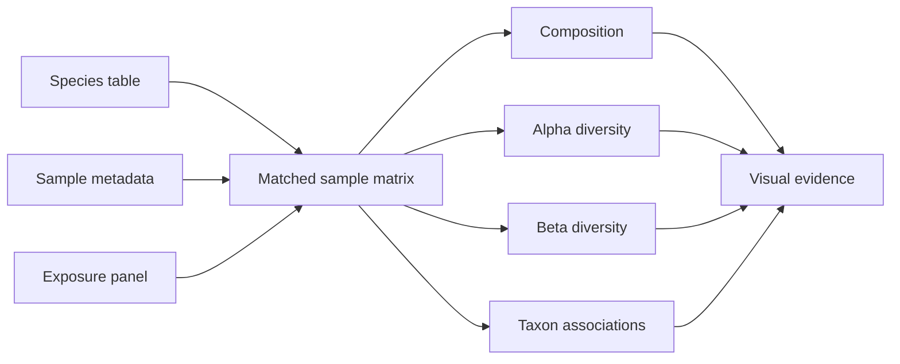

<div align="center">

# City on the skin

**A metagenomic view of palm microbiomes, cutotypes and urban chemical exposure**

[](https://github.com/Ci-yo/BIO211_CW3_Microbiome/actions/workflows/repository-check.yml)


<sub>Each column is a palm sample; the stacked profile shows its dominant species-level community.</sub>

</div>

## Project snapshot

This repository explores how **city**, **palm-skin cutotype**, **age** and a panel of **17 nicotine/PAH measurements** relate to species-level microbial profiles. The analysis joins three compact tables for 120 samples and follows the signal from community composition to alpha and beta diversity.

| Layer | What is measured | Main output |
|---|---|---|
| Taxonomy | species abundance | community composition and dominant taxa |
| Host/environment | city, cutotype, age | stratified abundance comparisons |
| Exposure | nicotine, cotinine and 15 PAHs | exposure–taxon associations |
| Diversity | richness, Shannon, Bray–Curtis, Jaccard | within- and between-sample structure |

## Visual story

<table>
  <tr>
    <td width="50%" align="center"><br><strong>Place</strong><br>City-stratified abundance patterns.</td>
    <td width="50%" align="center"><br><strong>Exposure</strong><br>Top pollutant–taxon relationships, coloured by city.</td>
  </tr>
  <tr>
    <td width="50%" align="center"><br><strong>Within-sample diversity</strong><br>Shannon diversity across cutotypes.</td>
    <td width="50%" align="center"><br><strong>Community separation</strong><br>Bray–Curtis ordination of sample composition.</td>
  </tr>
</table>

## Analysis map



The complete analysis is in [`R/01_taxonomy_alpha.R`](R/01_taxonomy_alpha.R). It keeps sample identifiers aligned before testing or plotting and records the transformations used for composition and diversity analyses.

## Repository guide

```text
BIO211_CW3_Microbiome/
├── R/                  analysis script
├── data/               species, metadata and exposure tables
├── figures/            ten publication-style result figures
├── scripts/            dependency-free repository validation
└── .github/workflows/  automated archive check
```

## Reproduce

Open `BIO211_CW3.Rproj`, install the packages declared near the top of the analysis script, and run:

```r
source("R/01_taxonomy_alpha.R")
```

For a lightweight archive check that does not require R:

```bash
python scripts/validate_repository.py
```

## Scope

This is a compact, reproducible archive of a completed metagenomics study. The data are retained because they are small enough for Git and necessary to reproduce the figures; temporary RStudio state and bulky intermediate objects are excluded.

> **Academic-use note**  
> This repository is a portfolio and reproducibility example. Do not submit its code, figures or interpretations as your own coursework.
