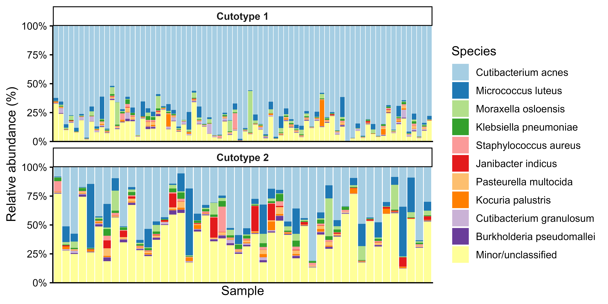
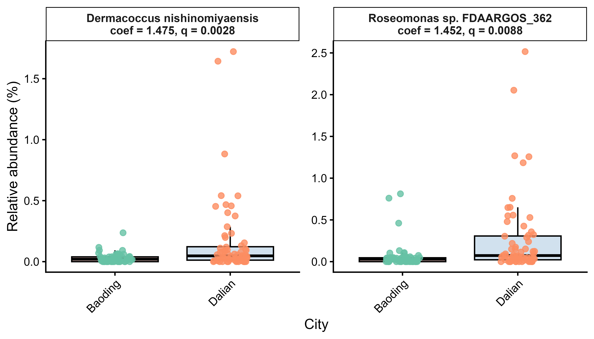
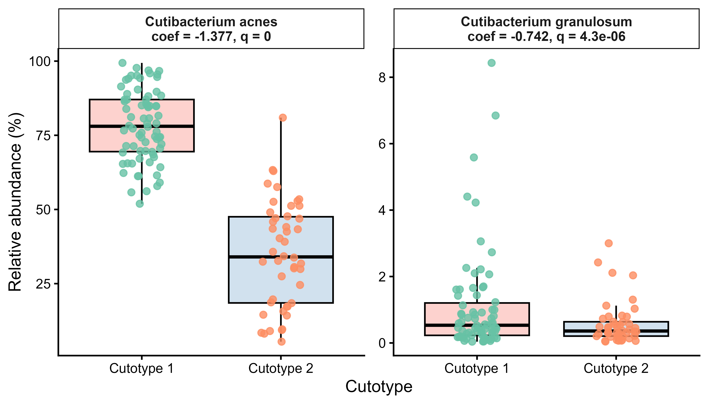
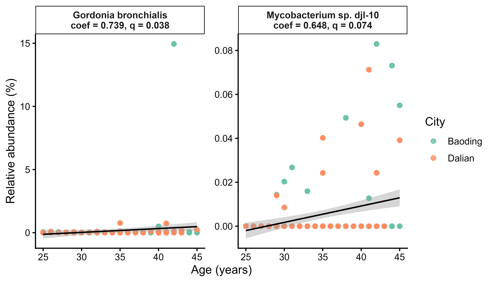
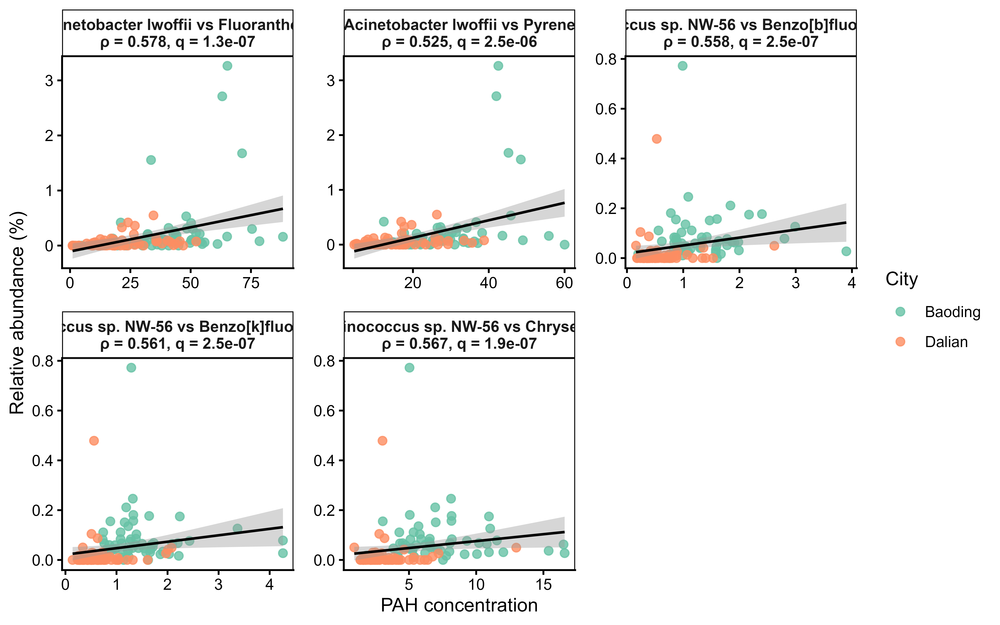
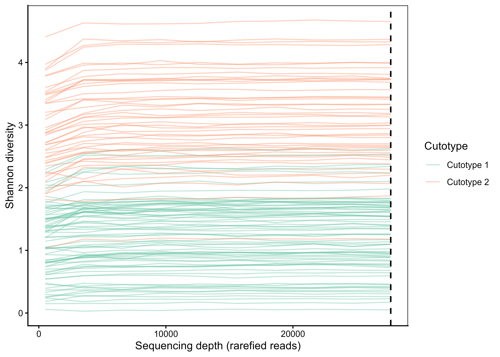
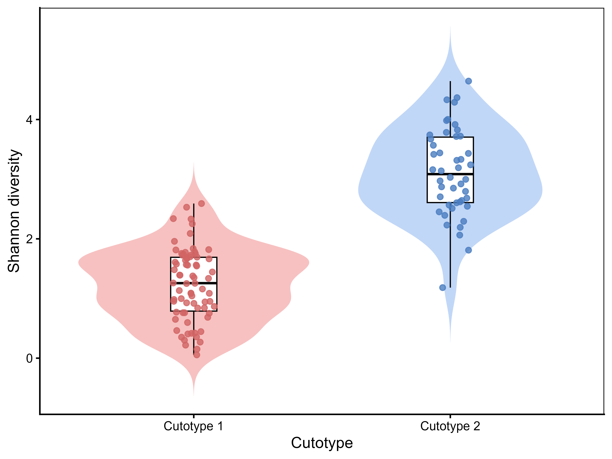
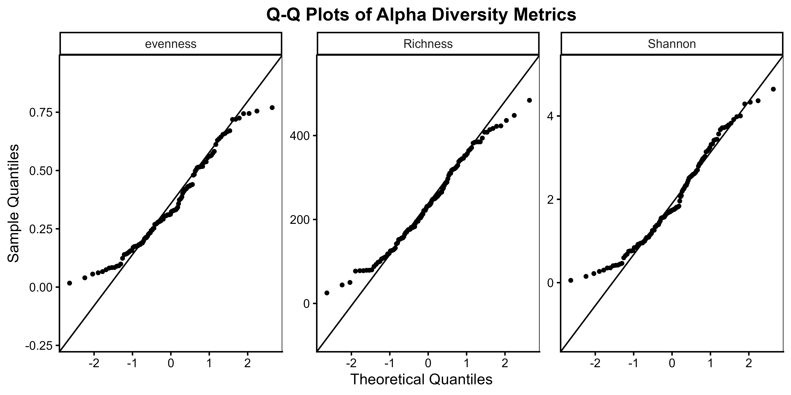
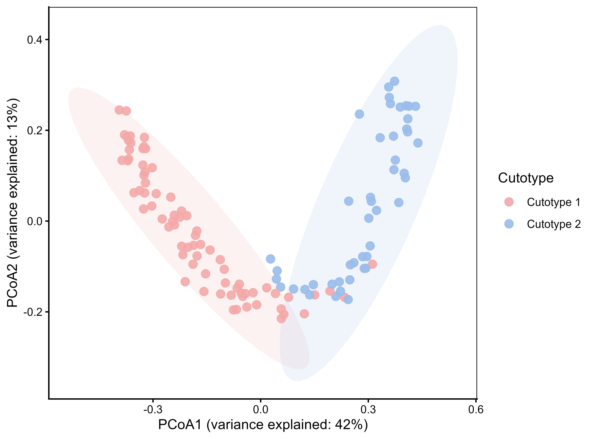
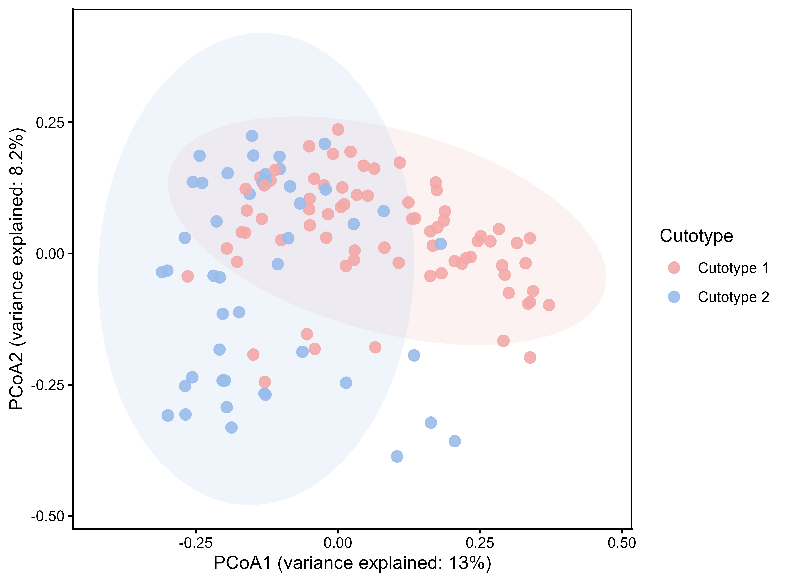

# BIO211 Coursework 3 – Palm skin metagenomic analysis

This repository contains the R code, input tables and figures for my BIO211 Coursework 3 project on the palm skin microbiome.

---

## Project overview

The dataset consists of **120 palm skin metagenomic samples** with:

- a **species-level count table** (`data/species_table.tsv`)
- **sample metadata** including City, Cutotype and Age (`data/metadata.tsv`)
- **pollutant measurements** for 15 PAHs plus Nicotine and Cotinine (`data/pollutant.tsv`)

The aim of the coursework was to:

1. Characterise **taxonomic composition** across **Cutotype 1 vs Cutotype 2**.
2. Perform **multivariable association analysis** with MaAsLin3 (City, Cutotype, Age).
3. Study **correlations between species abundance and pollutant levels** (Spearman, FDR).
4. Analyse **alpha diversity** (rarefaction, Shannon, richness).
5. Analyse **beta diversity** (Bray–Curtis, Jaccard, PCoA, PERMANOVA).

All analyses are implemented in a single, well-annotated R script so that the workflow can be reproduced from the processed input tables.

---

## Repository structure

```text
BIO211_CW3/
├─ BIO211_CW3.Rproj           # RStudio project
│
├─ R/
│  └─ 01_taxonomy_alpha.R     # main analysis script (Tasks 1–4)
│
├─ data/
│  ├─ metadata.tsv            # sample metadata
│  ├─ pollutant.tsv           # pollutant concentrations (PAHs, Nicotine, Cotinine)
│  └─ species_table.tsv       # species-level count table
│
├─ figures/                   # generated figures for the report
   ├─ Figure1_taxonomic_barplot.png
   ├─ Figure2_City_boxplots.png
   ├─ Figure3_Cutotype_boxplots.png
   ├─ Figure4_Age_scatter.png
   ├─ Figure5_PAH_top5_scatter_city.png
   ├─ Figure6_rarefaction_curve.png
   ├─ Figure7_Shannon_by_Cutotype.png
   ├─ Figure8_alpha_QQplots.png
   ├─ Figure9_PCoA_BrayCutotype.png
   └─ Figure10_PCoA_JaccardCutotype.png

```

---

## How to reproduce the analysis

1. **Clone the repository**

   ```bash
   git clone https://github.com/<your-username>/BIO211_CW3.git
   cd BIO211_CW3
   ```

2. **Open the R project**

   - Double-click `BIO211_CW3.Rproj` to open the project in RStudio.

3. **Install required R packages (first run only)**

   In R/RStudio:

   ```r
   install.packages(c(
     "tidyverse",
     "vegan",
     "Maaslin3",
     "viridis",
     "RColorBrewer"
   ))
   ```

4. **Run the main script**

   - Open `R/01_taxonomy_alpha.R`.
   - Source the script from top to bottom (`Ctrl+Shift+Enter` in RStudio)  
     to:
     - import the three `data/*.tsv` files,
     - perform taxonomic, association, correlation, alpha- and beta-diversity analyses,
     - write all figures to the `figures/` folder.

The figures in `figures/` match those referenced in the coursework report (`report/BIO211_CW3_report.pdf`).

---

## Figures

### Taxonomic composition and MaAsLin3 associations

**Figure 1 – Taxonomic composition across cutotypes**  
Stacked bar plot of species-level relative abundance across samples, faceted by cutotype.



**Figure 2 – City associations (MaAsLin3)**  
Boxplots of species strongly associated with City (Baoding vs Dalian).



**Figure 3 – Cutotype associations (MaAsLin3)**  
Boxplots of key Cutotype-associated species.



**Figure 4 – Age associations (MaAsLin3)**  
Scatter plots of age-associated species with regression lines.



---

### Pollutant correlations

**Figure 5 – Five strongest species–PAH associations**  
Scatter plots of species relative abundance vs PAH concentration for the five lowest FDR-corrected q-values.



---

### Alpha diversity

**Figure 6 – Rarefaction curves of Shannon diversity**  
Sample-wise Shannon diversity vs sequencing depth, coloured by cutotype.



**Figure 7 – Shannon diversity across cutotypes**  
Violin + boxplot of Shannon diversity for Cutotype 1 vs Cutotype 2.



**Figure 8 – Q–Q plots of alpha-diversity metrics**  
Normal Q–Q plots for evenness, richness and Shannon diversity.



---

### Beta diversity and community structure

**Figure 9 – Bray–Curtis PCoA by Cutotype**  
PCoA ordination of Bray–Curtis dissimilarities with 95% ellipses.



**Figure 10 – Jaccard PCoA by Cutotype**  
PCoA ordination of binary Jaccard distances with 95% ellipses.



---

## Notes

- The repository contains **processed tables only** (no raw sequencing data).
- The project was completed as part of the **BIO211 Metagenomic Data Analysis** coursework at XJTLU.
- Code is written for clarity and reproducibility, with comments marking each task (1–4) in the script.
